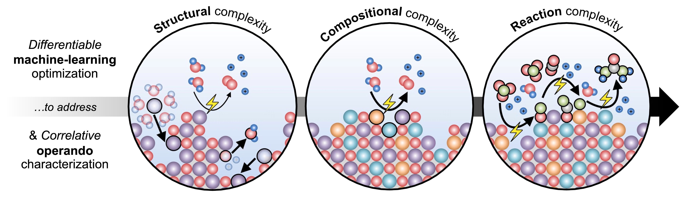

**I’m on the U.S. faculty job market!** My future research group will combine **differentiable machine-learning optimization** and **correlative operando characterization** as cross-cutting toolkits to design electrocatalytic materials for clean energy and sustainability, specifically for electrifying and decarbonizing diverse critical, yet challenging chemical transformations.

  

**I’ll be at the 2023 AIChE Annual Meeting to present my faculty candidate poster and faculty candidate talk, plus two technical talks.** Come to my presentations and let me know (jypeng@mit.edu) if you want to hear more about my future research group!

* **2dv – Faculty Candidate Poster Session** \| 11/5 (Sun), 1:00–3:00 PM \| Regency Ballroom R/S (Convention Level)
* **326j – Faculty Candidate Oral Session** \| 11/6 (Mon), 5:30–5:42 PM \| Orlando Ballroom M (Convention Level)
* **451a – Graph Neural Networks to Predict Ordering-Dependent Properties from Multicomponent Crystal Structures** \| 11/7 (Tue), 8:00–8:12 AM \| Rock Spring I/II (Lobby Level)
* **174g – Data-Driven Design Principles of Cation Ordering in Multicomponent Perovskite Oxides** \| 11/9 (Thu), 2:30–2:45 PM \| Celebration 14 (Convention Level)
